<p align="center">
  
</p>

<p align="center">
  <strong>Kamal Reddy</strong> · Electronics & Communication Engineering · Bengaluru
</p>

<p align="center">
  <a href="https://kamrede.page/">portfolio</a> &nbsp;·&nbsp;
  <a href="https://www.linkedin.com/in/kamal-reddy-bbab6731a/">linkedin</a> &nbsp;·&nbsp;
  <a href="mailto:kamalreddi2901@gmail.com">email</a>
</p>

<br/>

## I like building the part behind the button.

Interfaces matter. But the work I find most interesting is underneath them: **how a system reasons, what evidence it trusts, how it handles uncertainty, and whether the product remains useful when the demo ends.**

I study ECE at **BMS Institute of Technology & Management** and build across AI systems, decision tools, local-first software, civic tech, and experimental interfaces.

```text
input        noisy problem
process      understand → model → prototype → test
output       something clear enough to use
bias         useful > flashy, explainable > magical, shipped > hypothetical
```

### CURRENT SIGNAL

**CareerCase** — an explainable career exploration system for India. Its recommendation engine uses a versioned, deterministic **11-component matching model**, while AI is reserved for assisted exploration and explanation rather than silently deciding the score.

[open live product ↗](https://careercase.pages.dev/) · [inspect the system ↗](https://github.com/KamalReddy2901/AI-Enhanced-Career-Guidance-System-for-Personalized-Career-Pathways)

---

## Selected transmissions

<table>
<tr>
<td width="50%" valign="top">

### [CareerCase](https://github.com/KamalReddy2901/AI-Enhanced-Career-Guidance-System-for-Personalized-Career-Pathways)

**Career decisions that show their work.**  
Explainable matching, assessments, skill-gap analysis, pathways, simulations, and a portable Career Passport.

`React` `TypeScript` `Supabase` `Cloudflare`

[Live ↗](https://careercase.pages.dev/)

</td>
<td width="50%" valign="top">

### [Reflex](https://github.com/KamalReddy2901/reflex-app)

**A calmer relationship with your computer.**  
A native macOS experiment around detecting cognitive overload from interaction patterns and surfacing useful interventions.

`Swift` `SwiftUI` `Combine` `Core ML`

[Product ↗](https://reflexapp.pages.dev/)

</td>
</tr>
<tr>
<td width="50%" valign="top">

### [FactChecker AI](https://github.com/KamalReddy2901/factchecker-ai)

**Verification without leaving the page.**  
A browser extension that turns selected text or screenshots into grounded verdicts with confidence and cited evidence.

`WXT` `React` `TypeScript` `Gemini`

[Product ↗](https://factchecker-ai.pages.dev/)

</td>
<td width="50%" valign="top">

### [Urban Heat Intelligence](https://github.com/KamalReddy2901/PALS_Kamal)

**From heat maps to decisions.**  
A ward-level system for diagnosing Bengaluru heat vulnerability and comparing possible cooling interventions.

`Next.js` `TypeScript` `Leaflet` `Recharts`

[Live ↗](https://pals-kamal.pages.dev/)

</td>
</tr>
<tr>
<td width="50%" valign="top">

### [Nexus](https://github.com/KamalReddy2901/nexus)

**A second brain that can stay on your machine.**  
Local file ingestion, knowledge graphs, multi-hop retrieval, and private on-device models.

`Tauri` `Ollama` `ChromaDB` `SQLite`

[Source ↗](https://github.com/KamalReddy2901/nexus)

</td>
<td width="50%" valign="top">

### [Varanasi Formats](https://github.com/KamalReddy2901/varanasi)

**Engineering in service of atmosphere.**  
A cinematic adaptive-streaming web experience built around multi-resolution HLS playback and visual direction.

`Next.js` `TypeScript` `HLS.js` `Tailwind`

[Live ↗](https://varanasiformats.pages.dev/)

</td>
</tr>
</table>

<p align="center">
  <a href="https://kamrede.page/#projects"><strong>12 builds, experiments & prototypes →</strong></a>
</p>

---

## The three lenses I keep coming back to

| `SIGNAL` | `SYSTEM` | `STORY` |
|:--|:--|:--|
| What is actually happening beneath the noise? | How do the pieces interact, fail, recover and scale? | Can a human understand why this matters? |
| ECE · data · sensing · evidence | AI · architecture · product logic | interfaces · cinema · communication |

That overlap is the thread through most of what I build.

## Tools on the bench

<p align="center">
  
</p>

<details>
<summary><strong>What I care about more than the stack</strong></summary>
<br/>

- making AI behavior inspectable instead of mystical
- keeping product logic separate from generative output when it should be
- designing demos that survive contact with real users
- local-first and privacy-conscious architecture where it makes sense
- interfaces with a point of view, not generic dashboard chrome

</details>

<br/>

## Off-screen

I also work on curation at **TEDxBMSITM**, serve with the **Rotaract Club of BMS Yelahanka**, and spend an unreasonable amount of time thinking about cinema, product decisions, and why some ideas feel inevitable only *after* somebody ships them.

---

<p align="center">
  <sub>find the signal · understand the system · tell the story</sub>
</p>
